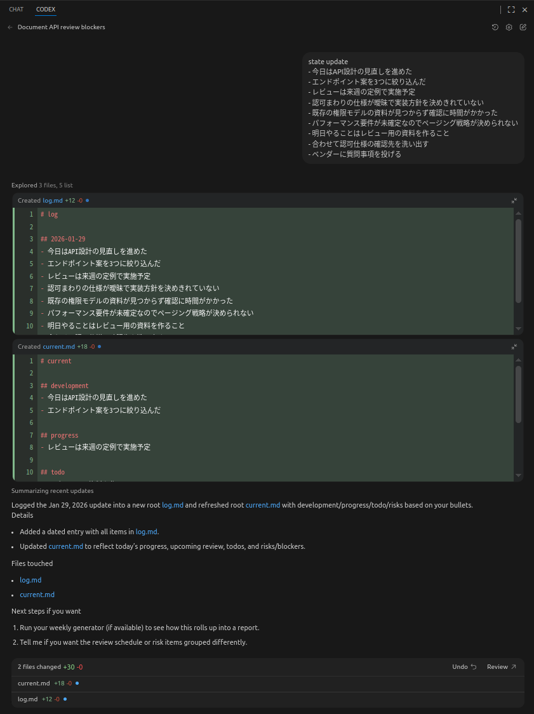
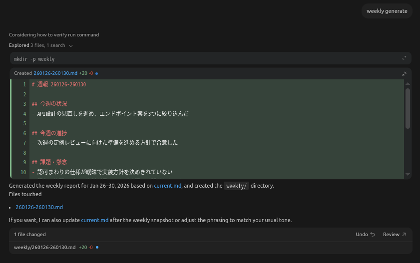

# 苦手な仕事を AI を用いて仕組み化してみる 〜週報 PoC〜
LT資料

## 背景
* 苦手な業務は基本的に仕組み化したいという怠惰性動機
* アウトプットの目処が立たない領域は得意ではなく、雑になりがち
* 例えば次のような報告業務
  * 週報
  * AI 技術調査
* AI を使って仕組み化できないかを考えた

## 問題意識
* 週報は毎週求められるが
* 大抵、何を書けば良いかの正解が分からない
* 結果として
  * 雑に書く
  * 精神的コストが高い

## 仮説
* 週報を直接作ろうとするからつらい
* 雑多な入力から一度 状態 に落とし
* 報告書はそこから生成できるのでは

## 基本的なアイディア
* SDD ツールでは agent 定義とテンプレート定義が提供される
  * spec-kit, cc-sdd
* SDD ツールでは
  * 中間状態
  * 最終成果物
    が仕様やコードとして明示的に扱われる
* この考え方を週報作成に転用できないかと考えた
* 中間状態を管理することでコンテキストを圧縮し
  出力を調節しながら最終的な報告書を生成する
* これを agent の手組みによって実現し
  * アイディアの PoC
  * agent の理解を深める
    ことを目的として試してみた
* なお agent を動かすためのプロンプトやテンプレートは ChatGPT に書いてもらっている

### SDDツールとの比較
| 観点       | SDD ツール            | 今回の週報 PoC               |
| ---------- | --------------------- | ---------------------------- |
| 対象領域   | ソフトウェア設計 開発 | 業務報告 週報                |
| 入力       | 要求                  | 日々の出来事 自由文          |
| 中間状態   | 設計仕様              | current 状態スナップショット |
| 最終成果物 | コード                | 週報 Markdown                |
| 定義方法   | ツールが提供          | **agent を手組み**               |
| 目的       | 開発の再現性 品質向上 | 報告業務の省力化 体裁統一    |

## 基本方針
* 自由文と構造化情報を分離する
* 正解を考えない
* 体裁を自動で整える

### 状態管理方針
* log
  * 日々の出来事をそのまま書く
  * 日本語で雑に書いて良い
* current
  * 週報用の状態スナップショット
  * 構造化された情報のみ

### 週報生成方針
* current を元に週報を生成
* 正解を考えず
* それっぽい日本語に変換するだけ
  * 「こういう週報にしたい」という意図を与えることもできるが
    そこを考えるのが苦手なので踏み込まない
  * 将来的には過去の週報から共通パターンを抽出し
    プロンプトに反映する余地はありそう

## 実装
### 状態更新プロンプト
.codex/state-update.md
```text
You are a state update agent.

Target files:
- log.md
- current.md

Hard constraints:
- Update only these two files: log.md and current.md
- Do not edit any other files
- Keep the user's Japanese text exactly as written in log.md
- Do not invent facts that are not present in the user's input

Initialization rules:
- If log.md does not exist, create it from templates/log.md
- If current.md does not exist, create it from templates/current.md
- Do not overwrite existing files during initialization

Step 1: Update log.md
- Append a new date section for today in YYYY-MM-DD at the end of log.md
- Format:
  - "## YYYY-MM-DD"
  - "- <line1>"
  - "- <line2>"
- Use each line of the user's input as one bullet line
- Do not modify past log entries
- Ensure the file ends with a newline

Step 2: Update current.md
- current.md must keep exactly these sections and headings:
  - "# current"
  - "## development"
  - "## progress"
  - "## todo"
  - "## risks"

Semantic rules:
- development: main development theme or phase (not tasks)
- progress: concrete progress or outcomes observed recently
- todo: actionable next tasks the user will do
- risks: uncertainties, dependencies, or blockers outside direct control

Formatting rules:
- Under each section, write bullet points
- Limit each section to at most 3 bullet points
- Use short noun phrases only
- Do not copy full sentences from the log
- Do not place the same item in multiple sections
- If there is no item for a section, keep a single "-" line

Readability rules:
- Order items by importance or immediacy, highest first
- Keep each item within 20 Japanese characters if possible
- Normalize wording for consistency
  - e.g. "仕様が未確定" -> "仕様未確定"

Safety rules:
- Do not output shell commands or explanations
- Output only the final file contents

Ensure the file ends with a newline

Output:
- Apply edits to both files
```

日本語訳
```markdown
あなたは状態更新用の agent です。

対象ファイル:
- log.md
- current.md

厳守事項:
- 更新してよいのは log.md と current.md のみ
- 他のファイルは編集しない
- log.md にはユーザーが入力した日本語をそのまま記録する
- 入力に含まれない事実を推測して書かない

初期化ルール:
- log.md が存在しない場合は templates/log.md を元に作成する
- current.md が存在しない場合は templates/current.md を元に作成する
- 初期化時に既存ファイルを上書きしない

Step 1 log.md の更新:
- 今日の日付 YYYY-MM-DD のセクションを log.md の末尾に追加する
- フォーマットは以下とする
  - ## YYYY-MM-DD
  - - 入力1行目
  - - 入力2行目
- ユーザー入力の各行を1つの箇条書きとして記録する
- 過去のログは変更しない
- ファイル末尾に改行を入れる

Step 2 current.md の更新:
- current.md は以下の見出し構成を必ず維持する
  - # current
  - ## development
  - ## progress
  - ## todo
  - ## risks

意味ルール:
- development 開発の主テーマやフェーズを表す 作業内容は含めない
- progress 最近確認できた具体的な進捗や成果
- todo 次に行う具体的な作業
- risks 不確実要素 外部依存 制御できない課題

書式ルール:
- 各セクションは箇条書きで記載する
- 各セクション最大3項目まで
- 短い名詞句のみを使用する
- log.md の文章をそのままコピーしない
- 同じ内容を複数のセクションに記載しない
- 該当項目がない場合は - のみを記載する

可読性ルール:
- 重要度または緊急度の高い順に並べる
- 可能な限り20文字以内にする
- 表現を正規化する
  - 例 仕様が未確定 → 仕様未確定

安全ルール:
- シェルコマンドや説明文を出力しない
- 最終的なファイル内容のみを出力する

ファイル末尾に改行を入れること

出力:
- log.md と current.md に変更を適用する
```

### 週報生成プロンプト
.codex/weekly-generate.md
```markdown
You are a weekly report generation agent.

Source files:
- current.md
- templates/weekly.md

Target file:
- weekly/YYMMDD-YYMMDD.md

Hard constraints:
- Use only current.md as the source of facts
- Do not invent any new facts
- Keep the exact heading structure from templates/weekly.md
- Output must be in Japanese
- Ensure the file ends with a newline
- Do not create or modify any files or directories except the target file under weekly/

Period rules:
- Determine the reporting period based on the execution date
- The start date is the Monday of the execution date's week
- The end date is the Friday of the same week
- Do not include Saturday or Sunday
- If the execution date is Saturday or Sunday, use the previous week's Monday to Friday
- The file name format is YYMMDD-YYMMDD.md using the start and end dates
- The output directory is weekly/
- If the weekly/ directory does not exist, create it

Mapping rules from current.md:
- "## development" -> "## 今週の状況"
- "## progress" -> "## 今週の進捗"
- "## risks" -> "## 課題・懸念"
- "## todo" -> "## 次週の予定"

Writing rules:
- Convert each bullet item into a short Japanese bullet line
- Keep wording simple and neutral
- Do not add reasons, background, or assumptions
- If a section has no meaningful items, write "- 特になし"
- Keep each bullet within 30 Japanese characters if possible
- Do not change item meaning, only rephrase lightly for readability
- Do not output any shell commands

Output:
- Create or overwrite the target file for the computed period
```

日本語訳
```markdown
あなたは週報生成用の agent です。

参照ファイル:
- current.md
- templates/weekly.md

出力ファイル:
- weekly/YYMMDD-YYMMDD.md

厳守事項:
- 事実情報は current.md のみを使用する
- 新しい事実を追加しない
- templates/weekly.md の見出し構成を変更しない
- 出力は日本語とする
- ファイル末尾に改行を入れる
- weekly 配下以外のファイルやディレクトリを変更しない

期間ルール:
- 実行日の属する週の月曜日から金曜日を対象期間とする
- 土日実行時は前週の月曜から金曜を使用する
- ファイル名は YYMMDD-YYMMDD.md とする
- 出力先は weekly ディレクトリ
- weekly ディレクトリが存在しない場合は作成する

current.md からの対応関係:
- development → 今週の状況
- progress → 今週の進捗
- risks → 課題 懸念
- todo → 次週の予定

記述ルール:
- 各項目を簡潔な日本語の箇条書きに変換する
- 中立的で淡々とした表現にする
- 理由や背景を追加しない
- 有効な項目がない場合は 特になし と記載する
- 可能な限り30文字以内にする
- 意味を変えず 読みやすさのみを調整する
- シェルコマンドを出力しない

出力:
- 計算された期間の週報ファイルを作成または上書きする
```

### テンプレート
templates/log.md
```markdown
# log
```
templates/current.md
```markdown
# current

## development
-

## progress
-

## todo
-

## risks
-
```
templates/weekly.md
```markdown
# 週報 YYMMDD-YYMMDD

## 今週の状況
-

## 今週の進捗
-

## 課題・懸念
-

## 次週の予定
-

## メモ
-
```

## デモ

### 状態更新


### 週報生成


### 生成結果
log.md
```markdown
# log

## 2026-01-29
- 今日はAPI設計の見直しを進めた
- エンドポイント案を3つに絞り込んだ
- レビューは来週の定例で実施予定
- 認可まわりの仕様が曖昧で実装方針を決めきれていない
- 既存の権限モデルの資料が見つからず確認に時間がかかった
- パフォーマンス要件が未確定なのでページング戦略が決められない
- 明日やることはレビュー用の資料を作ること
- 合わせて認可仕様の確認先を洗い出す
- ベンダーに質問事項を投げる
```

current.md
```markdown
# current

## development
- 今日はAPI設計の見直しを進めた
- エンドポイント案を3つに絞り込んだ

## progress
- レビューは来週の定例で実施予定

## todo
- レビュー用の資料を作る
- 認可仕様の確認先を洗い出す
- ベンダーに質問事項を投げる

## risks
- 認可まわりの仕様が曖昧で実装方針を決めきれていない
- 既存の権限モデルの資料が見つからず確認に時間がかかった
- パフォーマンス要件が未確定なのでページング戦略が決められない
```


260126-260130.md (週報)
```markdown
# 週報 260126-260130

## 今週の状況
- API設計の見直しを進め、エンドポイント案を3つに絞り込んだ

## 今週の進捗
- 次週の定例レビューに向けた準備を進める方針で合意した

## 課題・懸念
- 認可まわりの仕様が曖昧で実装方針を決めきれていない
- 既存の権限モデルの資料が見つからず確認に時間がかかった
- パフォーマンス要件が未確定のためページング戦略が決められない

## 次週の予定
- レビュー用の資料を作成する
- 認可仕様の確認先を洗い出す
- ベンダーに質問事項を投げる

## メモ
- 来週の定例でレビュー予定
```

## 気づきなど
* 実行環境の準備の簡便性を取ってcodex利用にしているが、copilotの方が良いかも
* codexでagentプロンプトを変えて再実行しても同じセッション上だと古いプロンプトの指示のままになってしまう場合があった
* spec kitでもそうだったが、chatgptによるとプロンプトは英語記述が良いらしい。diffusion modelとかに親しい。

## 展望
* 状態管理項目と変換指示のブラッシュアップ
* f2f対策の資料自動生成
* AI 技術調査への応用
  * grokの話をこっちでやろうと思ってたが、ローカルagent動かす方に興が乗ってしまった

## まとめ
* 苦手は努力で克服しないのが好み
* AI使って仕組み化して対処できれば良いと思っている
* 今回のPoCを通じてagent理解とアイディア実現を試してみた